# Nadri

지역별 관광 데이터를 활용한 여행 정보 사이트
Spring Boot + Vue.js 2 + MySQL
<br/> <br/>

## 프로젝트 소개

여행 정보, 여행 계획, 커뮤니티, 통계 등의 기능을 제공하는 여행 정보 사이트입니다.<br/>
프로젝트 설명 영상 : https://youtube.com/watch?v=uVQEhLR_w4M&feature=share
<br/> <br/>

### 개발 기간

`- 2023.05.8~2023.05.25`

### 멤버구성

- 김유정 - BackEnd
- 이제성 - FrontEnd

### 개발환경

- Front

  - IDE : Visual Studio Code
  - Framework : Vue.js 2.0
  - Library : emailjs, cheerio, vue-chartjs

- Back
  - IDE : STS 3.9.14
  - Framework : Springboot
  - Database : MySQL
  - ORM : Mybatis

## 주요기능 목차

- 메인화면
  - 메인 화면
  - 메인 베너
  - 국내여행 소식
- 계정관리
  - 회원가입
  - 로그인
  - 비밀번호 찾기
- 여행지정보
  - 여행지정보 조회
- 여행노트
  - 여행노트 조회
  - 여행노트 작성
- 커뮤니티
  - 게시글 조회, 좋아요, 댓글
  - 게시글 검색
  - 게시글 작성
  - 게시글 수정, 삭제
- 공지사항
  - 공지사항
- 통계
  - 통계
- 마이페이지
  - 프로필 수정
  - 최근 본 여행지, 여행노트

## 주요기능

<br/>

### 메인화면

- 메인화면  
  

- 메인 화면 베너  
  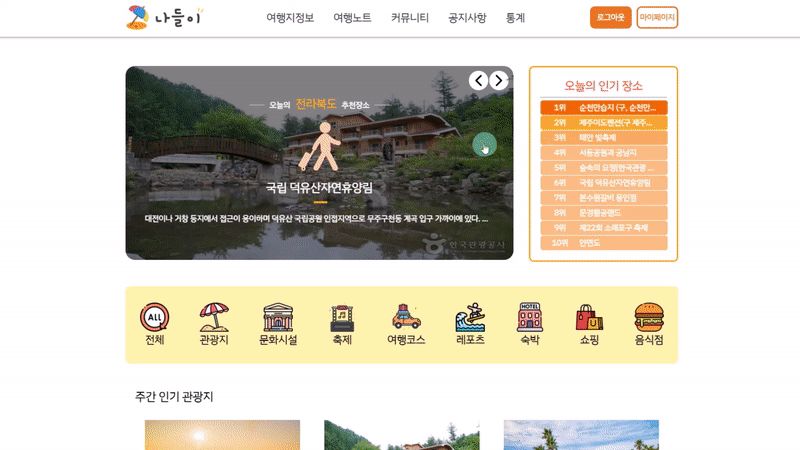
  ```
  - 지역별 인기 여행지
  - 일일, 주간, 월간 인기 여행지
  ```
- 국내여행 소식  
  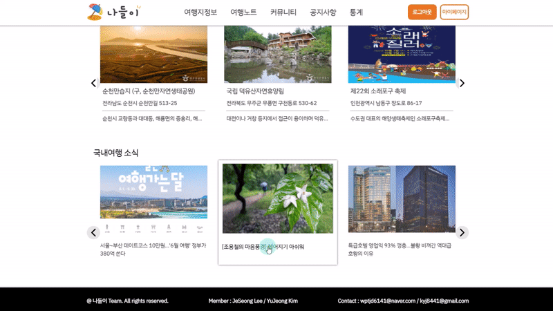
  ```
  - 국내 여행 정보 관련 뉴스를 크롤링하여 제공
  ```
  <br/>

### 계정관리

- 회원가입  
  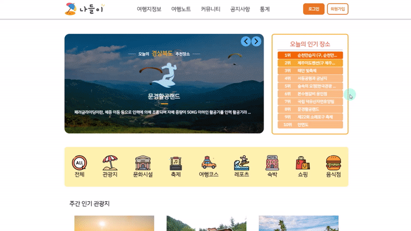

  ```
  - 항목에 따라 유효성 및 중복 검사하여 회원가입
  - 비밀번호는 해시값으로 변환되어 DB에 저장
  ```

- 로그인  
  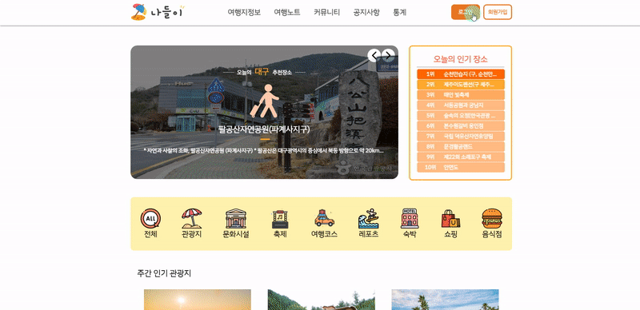

  ```
  - JWT로 구현
  - 아이디, 비밀번호를 입력받아 DB 정보와 일치하는 경우 Refresh, Accesss 토큰 발급
  ```

- 비밀번호 찾기  
  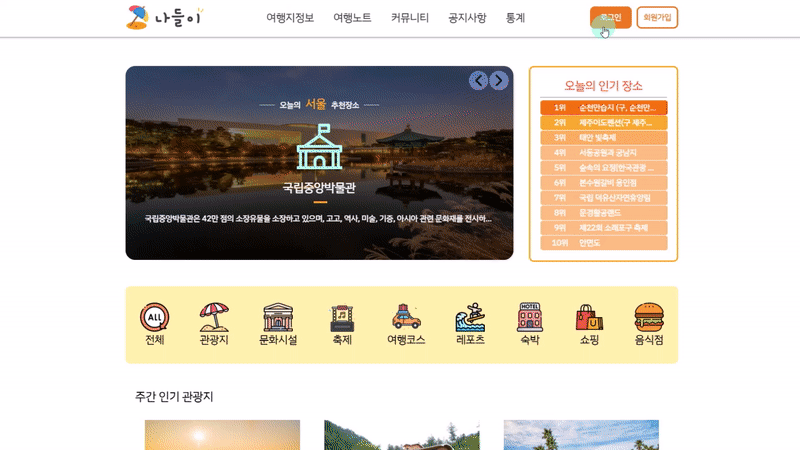
  ```
  - email.js API를 이용하여 이메일 전송 구현
  - 회원 정보와 일치하는 아이디, 이메일을 입력받은 경우 해당 이메일로 인증번호를 포함하여 메일 전송
  - 사용자가 입력한 인증번호가 일치할 시 비밀번호초기화
  ```
  <br/>

### 여행지정보

- 여행지정보  
  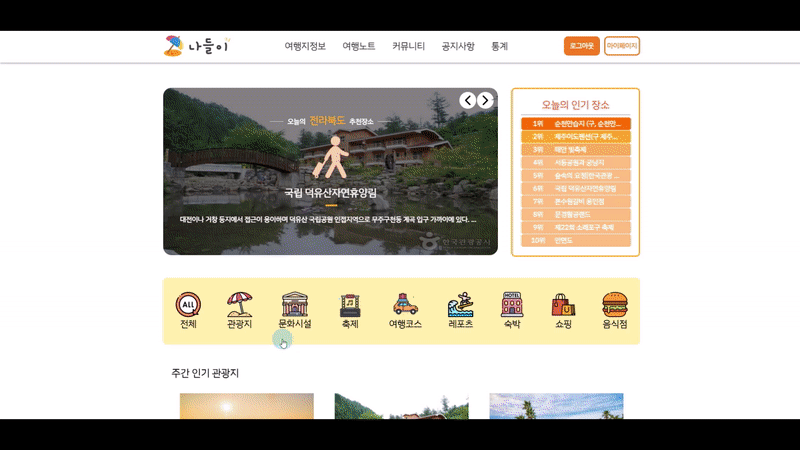
  ```
  - 여행지정보탭을 클릭하여 들어가거나
  - 메인 화면에서 여행지 타입에 해당하는 아이콘 클릭시 해당 타입의 여행지정보 검색
  - 시도, 구군, 여행지타입, 여행지명을 선택하여 검색 가능
  ```
  <br/>

### 여행노트

- 여행노트 조회  
  
  ```
  - 여행노트 조회, 좋아요 가능
  - 좋아요를 누르면 찜한 여행노트에 표시
  ```
- 여행노트 작성  
  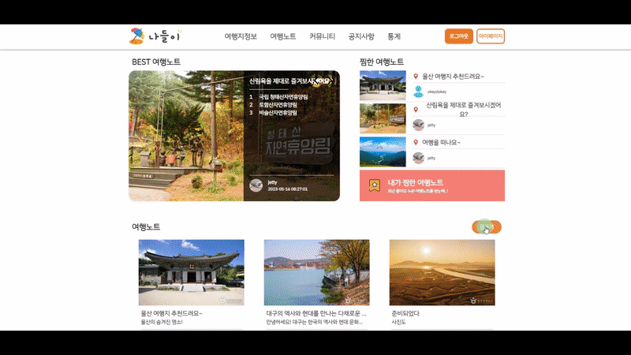
  ```
  - 회원인 경우 여행노트 작성 가능
  - 여행노트탭에서 글쓰기 클릭시 여행지정보탭으로 이동
  - 리스트에서 여행지를 클릭한 후 +를 클릭하여 여행 노트에 추가
  - 메모, 제목, 내용을 작성하여 노트 생성 클릭
  - 여행노트에 등록완료, 조회 가능
  ```
  <br/>

### 커뮤니티

- 게시글 조회, 좋아요, 댓글  
  
  ```
  - 비회원으로 게시글 조회 가능
  - 회원인 경우에만 좋아요, 댓글 가능
  ```
- 게시글 검색  
  
  ```
  -게시글을 제목, 닉네임으로 검색 가능
  ```
- 게시글 작성  
  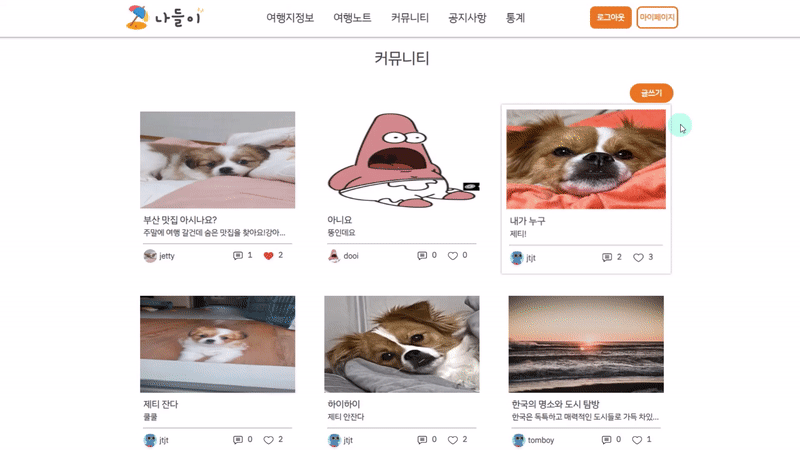
  ```
  - 회원인 경우 게시글 작성 및 사진 첨부 가능
  ```
- 게시글 수정, 삭제  
  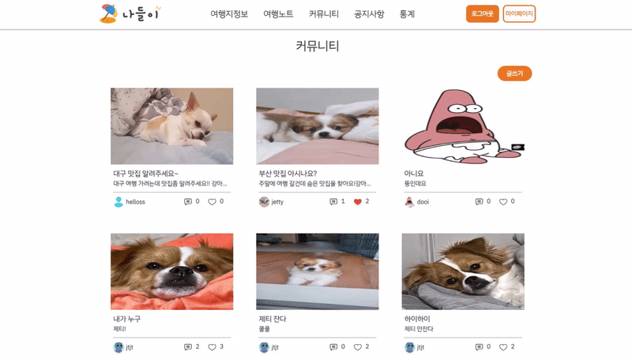
  ```
  - 본인이 작성한 게시글에 한해 수정, 삭제 가능
  ```
  <br/>

### 공지사항

- 공지사항  
  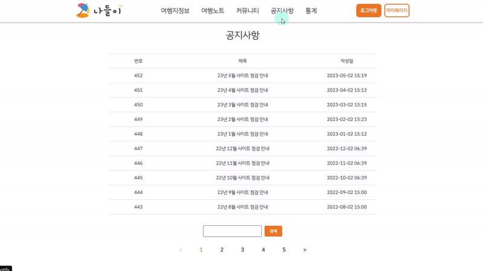
  ```
  - 공지사항 조회, 검색 가능
  - 관리자 계정으로만 작성, 수정, 삭제 가능
  ```
  <br/>

### 통계

- 통계  
  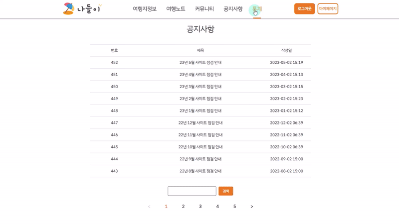
  ```
  - 사용자들의 여행지 조회를 날짜별로 기록하여 파이, 막대 그래프로 나타냄
  ```
  <br/>

### 마이페이지

- 프로필 수정  
  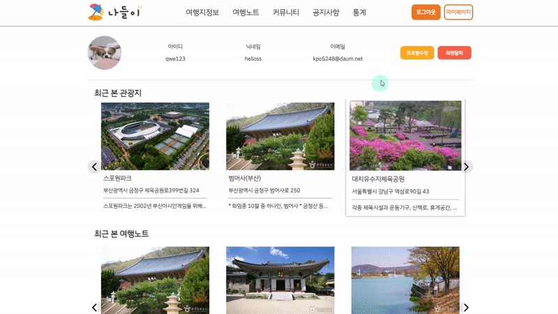
  ```
  - 사용자의 프로필 사진 및 계정 정보 수정
  ```
- 최근 본 여행지, 여행노트  
  
  ```
  - 사용자가 최근 본 여행지, 여행 노트를 마이페이지에서 확인할 수 있음
  ```
